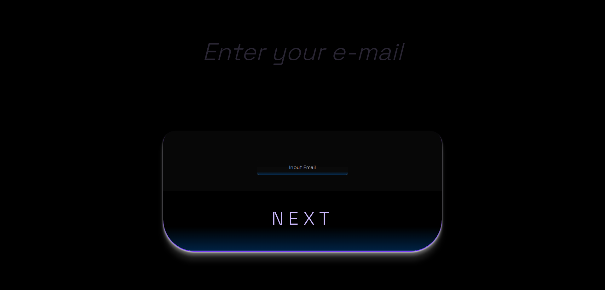

<h1>TimeTraveler</h1>

<h2><a id="user-content-tabla-de-contenido" class="anchor" aria-hidden="true" href="#tabla-de-contenido"><svg class="octicon octicon-link" viewBox="0 0 16 16" version="1.1" width="16" height="16" aria-hidden="true"><path fill-rule="evenodd" d="M7.775 3.275a.75.75 0 001.06 1.06l1.25-1.25a2 2 0 112.83 2.83l-2.5 2.5a2 2 0 01-2.83 0 .75.75 0 00-1.06 1.06 3.5 3.5 0 004.95 0l2.5-2.5a3.5 3.5 0 00-4.95-4.95l-1.25 1.25zm-4.69 9.64a2 2 0 010-2.83l2.5-2.5a2 2 0 012.83 0 .75.75 0 001.06-1.06 3.5 3.5 0 00-4.95 0l-2.5 2.5a3.5 3.5 0 004.95 4.95l1.25-1.25a.75.75 0 00-1.06-1.06l-1.25 1.25a2 2 0 01-2.83 0z"></path></svg></a>Tabla de contenido
</h2>
<ul>
  <li><a href="#introduccion-al-proyecto">Introducción al proyecto</a></li>
  <li><a href="#implementaci%C3%B3n-del-proyecto">Implementacion del proyecto</a></li>
  <li><a href="#iniciar-aplicacion">Iniciar application</a></li>
</ul>

<h2><a id="user-content-introduccion-al-proyecto" class="anchor" aria-hidden="true" href="#introduccion-al-proyecto"><svg class="octicon octicon-link" viewBox="0 0 16 16" version="1.1" width="16" height="16" aria-hidden="true"><path fill-rule="evenodd" d="M7.775 3.275a.75.75 0 001.06 1.06l1.25-1.25a2 2 0 112.83 2.83l-2.5 2.5a2 2 0 01-2.83 0 .75.75 0 00-1.06 1.06 3.5 3.5 0 004.95 0l2.5-2.5a3.5 3.5 0 00-4.95-4.95l-1.25 1.25zm-4.69 9.64a2 2 0 010-2.83l2.5-2.5a2 2 0 012.83 0 .75.75 0 001.06-1.06 3.5 3.5 0 00-4.95 0l-2.5 2.5a3.5 3.5 0 004.95 4.95l1.25-1.25a.75.75 0 00-1.06-1.06l-1.25 1.25a2 2 0 01-2.83 0z"></path></svg></a>Introduccion al proyecto</h2>

TimeTraveler es un visualizador de itinerarios que tiene la capacidad de integrarse con productos de empresas terceras. Ofrecemos un servicio donde el cliente final podra estar al tanto de todos los detalles de su proximo viaje. Nuestro producto es simple pero esta lleno de detalles, todas las animaciones fueron creadas a mano y con especial cuidado.

<h2><a id="user-content-implementación-del-proyecto" class="anchor" aria-hidden="true" href="#implementación-del-proyecto"><svg class="octicon octicon-link" viewBox="0 0 16 16" version="1.1" width="16" height="16" aria-hidden="true"><path fill-rule="evenodd" d="M7.775 3.275a.75.75 0 001.06 1.06l1.25-1.25a2 2 0 112.83 2.83l-2.5 2.5a2 2 0 01-2.83 0 .75.75 0 00-1.06 1.06 3.5 3.5 0 004.95 0l2.5-2.5a3.5 3.5 0 00-4.95-4.95l-1.25 1.25zm-4.69 9.64a2 2 0 010-2.83l2.5-2.5a2 2 0 012.83 0 .75.75 0 001.06-1.06 3.5 3.5 0 00-4.95 0l-2.5 2.5a3.5 3.5 0 004.95 4.95l1.25-1.25a.75.75 0 00-1.06-1.06l-1.25 1.25a2 2 0 01-2.83 0z"></path></svg></a>Implementación del proyecto</h2>
<ul>
<li><strong>React</strong>: Framework utilizado para la creacion del proyecto.</li>
<li><strong>TypeScript</strong>: Superset de JavaScript que implementa tipado estricto.</li>
<li><strong>ChakraUI</strong>: Libreria utilizada para el desarrollo de componentes.</li>
</ul>

Empezamos definiendo una estructura de directorios que nos permita escalar con el tiempo, los componentes fueron desarrollados con el fin de que esten disponibles para ser reutilizados en otros proyectos.
Primero habiamos pensado en utilizar clases, pero con el tiempo y mientras ibamos definiendo las ideas me decante por utilizar hooks para tener un codigo mas limpio y legible.
Siguiendo con la modularidad, ChakraUI se adaptaba muy bien a nuestras necesidades y no lo pensamos dos veces a la hora de implementarlo.

<h2><a id="user-content-iniciar-aplicacion" class="anchor" aria-hidden="true" href="#iniciar-aplicacion"><svg class="octicon octicon-link" viewBox="0 0 16 16" version="1.1" width="16" height="16" aria-hidden="true"><path fill-rule="evenodd" d="M7.775 3.275a.75.75 0 001.06 1.06l1.25-1.25a2 2 0 112.83 2.83l-2.5 2.5a2 2 0 01-2.83 0 .75.75 0 00-1.06 1.06 3.5 3.5 0 004.95 0l2.5-2.5a3.5 3.5 0 00-4.95-4.95l-1.25 1.25zm-4.69 9.64a2 2 0 010-2.83l2.5-2.5a2 2 0 012.83 0 .75.75 0 001.06-1.06 3.5 3.5 0 00-4.95 0l-2.5 2.5a3.5 3.5 0 004.95 4.95l1.25-1.25a.75.75 0 00-1.06-1.06l-1.25 1.25a2 2 0 01-2.83 0z"></path></svg></a>Iniciar aplicacion</h2>

Necesitaras esta dependencia para correr el proyecto:

<ul>
    <li><a href="https://nodejs.org/es" rel="nofollow">Node</a>.</li>
</ul>

 

Instalar librerias:

<pre><code>yarn install
</code></pre>

Crear build:

<pre><code>yarn build
</code></pre>

Correr la aplicacion:

<pre><code>yarn start
</code></pre>
